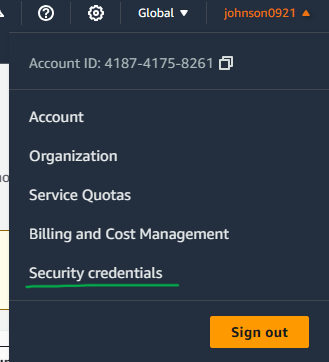
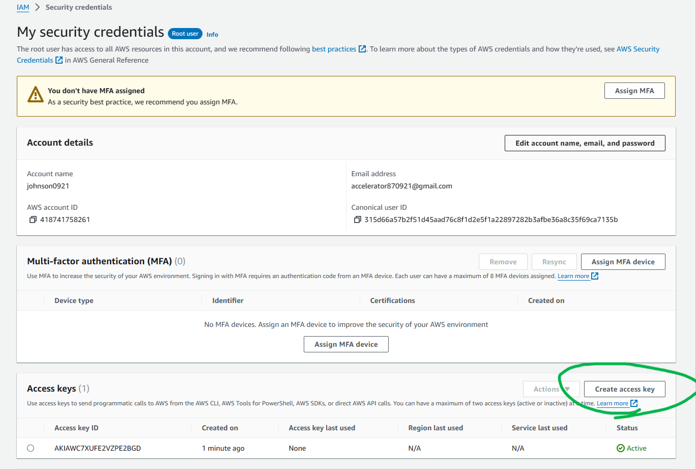

---
title: AWS CLI Setup
author: Johnson Wang
pubDatetime: 2023-12-19T09:21:21Z
postSlug: aws-cli-setup
featured: false
draft: false
tags:
  - AWS
description: How to setup AWS CLI on your local machine (Ubuntu Linux)
---

How to setup AWS CLI on your local machine (Ubuntu Linux)

```bash
sudo apt-get update

sudo apt-get install awscli
```

check the version to ensure the AWS CLI is installed successfully

```bash
aws --version

aws configure
```

Enter the requested information:

- AWS Access Key ID: Enter the access key ID obtained from the AWS IAM console.
- AWS Secret Access Key: Enter the secret access key associated with the access key ID.
- Default region name: Enter the AWS region you want to use by default (e.g., us-east-1, us-west-2, ap-northeast-1).
- Default output format: You can leave this as the default (usually JSON).

you can find the access key ID from here faster:

 

run this command to check the configuration you just entered

```bash
aws configure list
```
