## Start

First things first, create and activate an AWS Account. Then, install and configure the AWS CLI on your local machine. We will use it to interact with AWS from the command line interface.

You can ref to this article for AWS CLI installation: [AWS CLI Setup](https://johnson7543.com/posts/aws-cli-setup)

### In this demo

- I'll utilize this [repository](https://github.com/johnson7543/ims.git). _[OPTIONAL]_ If you want to use my repository for deployment, you need to prepare a MongoDB to connect.

- You can also use this simple [repo](https://github.com/johnson7543/circleci-ecs) to practice the deployment.

- The AWS region of choice will be Asia Pacific (Tokyo) - **ap-northeast-1**, run the command `aws configure set region ap-northeast-1` to change your region.

## VPC (Virtual Private Cloud)

Next, we will use the default Virtual Private Cloud (VPC) that is automatically created when we created our AWS account. If you are using a new AWS Account, default vpc should be there already.

If it is not available, you can create a default VPC by running:

```bash
aws ec2 create-default-vpc
```

Confirm that we have a VPC that we can work with by running:

```bash
aws ec2 describe-vpcs
```

## ECS Cluster (Elastic Container Service Cluster)

After confirming that we have a default VPC, let’s create a security group that we’ll use later:

```bash
aws ec2 create-security-group --group-name circleci-tokyo --description "Circle CI Security Group"
```

Next, we will be creating an ECS Cluster and the associated EC2 instance.

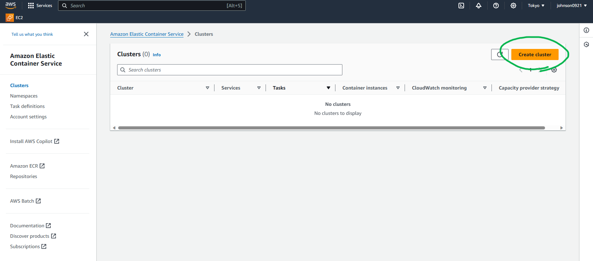

We will call the cluster circleci-cluster. We need to attach the circleci-tokyo security group that we created in earlier.

| Parameter                     | Value                                    |
| ----------------------------- | ---------------------------------------- |
| Cluster name                  | circleci-cluster                         |
| Infrastructure                | Amazon EC2 instances                     |
| Provisioning model            | On-demand                                |
| Operating system/Architecture | Amazon Linux 2                           |
| EC2 instance type             | t2.micro (free tier eligible)            |
| Network                       | Use default VPC with all of its subnets  |
| Security group                | circleci-tokyo (the one we just created) |

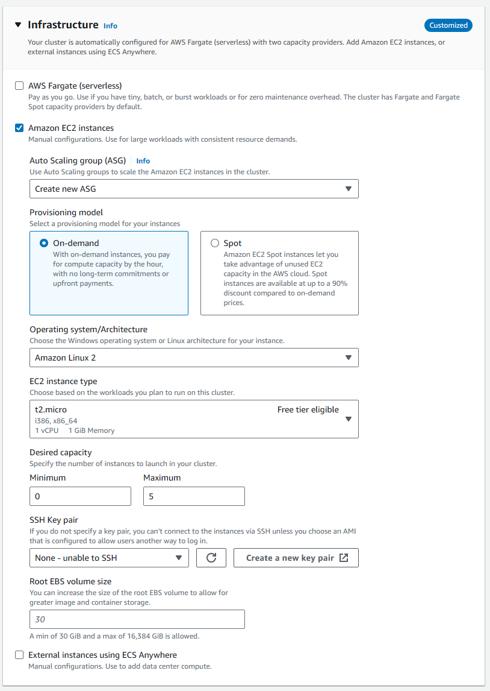


## ELB (Elastic Load Balancing)

Create an ELB and a target group to later associate with our ECS service.
We are creating an ELB because we eventually want to load balance requests across multiple containers and we also want to expose our Go application to the internet for testing.

### Configure the Load Balancer

Go to EC2 Console > Load Balancing > Load Balancers and click Create Load Balancer and select Application Load Balancer.

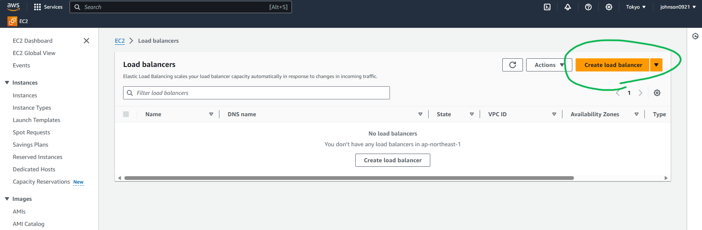

Name it **circleci-elb-tokyo** and select internet-facing.

Under listeners, use the default listener with a HTTP protocol and port 80.

Under Availability Zone, chose the VPC that was used during cluster creation and choose the subnets that you want.

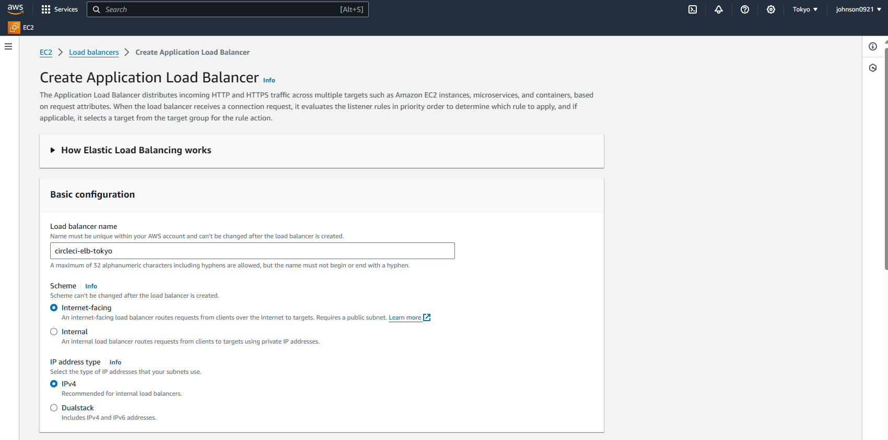

Select your VPC with subnets and create a new security group for ELB.

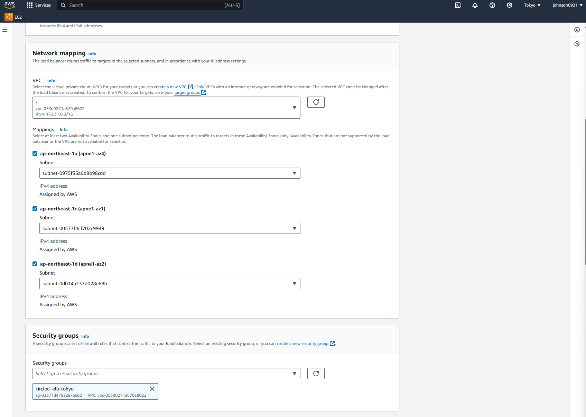

Create a new security group named **circleci-elb-tokyo** and open up All TCP and source 0.0.0.0/0 so anything from the outside world can access the ELB.
_**Set up for both Inbound and Outbound rules**_


Create and select the target group


Create a new target group name circleci-target-group with HTTP port 80.


The circleci-elb-tokyo security group opens the circleci-elb load balancer’s port 80 to the world. Now, we need to make sure that the circleci-tokyo security group associated with the ECS instance allows traffic from the load balancer. To allow all ELB traffic to hit the container instance, run the following:

```bash
aws ec2 authorize-security-group-ingress --group-name circleci-tokyo --protocol tcp --port 1-65535 --source-group circleci-elb-tokyo
```

With these security group rules:

1. Only port 80 on the ELB is exposed to the outside world.

2. Only traffic from the ELB going to a container instance with the circleci-target-group group is allowed.

You can check the rule in EC2 -> Security Groups -> circleci-tokyo -> Inbound rules.

## ECR (Elastic Container Registry)

Create an image repository on ECR by following these instructions.

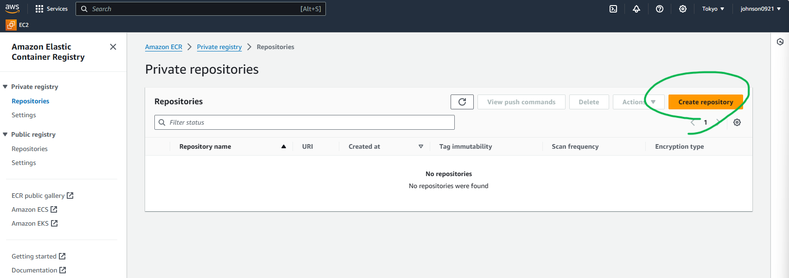

Name it **circleci**.


AWS accounts have unique ID’s. Change 418741758261 in the following command appropriately. After getting the repository name, we can now tag the image accordingly:

## Prepare the Go application

### Skip to docker build part if you are using your own repo

```bash
git clone https://github.com/johnson7543/ims.git
cd ims

# go to the .env file under the root path
# update the MONGO_DB_NAME and MONGO_DB_URL for your own DB.
# The password will be saved on CircleCI; here, just keep it as {ENV_MONGO_DB_PASSWORD}.


```

### Run docker build and tag in your repository

```bash
# Replace the {your MongoDB password} with your MongoDB password.
docker build -t ims-ecs:v1 --build-arg ENV_MONGO_DB_PASSWORD={your MongoDB password} .
docker tag ims-ecs:v1 418741758261.dkr.ecr.ap-northeast-1.amazonaws.com/circleci:latest
```

```bash
# If there is no DB password, just run the following command
docker build -t ims-ecs:v1
docker tag ims-ecs:v1 418741758261.dkr.ecr.ap-northeast-1.amazonaws.com/circleci:latest
```

Retrieves an authentication token from AWS ECR for the specified region and uses it to log in to the specified ECR registry using Docker

```bash
aws ecr get-login-password --region ap-northeast-1 | docker login --username AWS --password-stdin 418741758261.dkr.ecr.ap-northeast-1.amazonaws.com
```

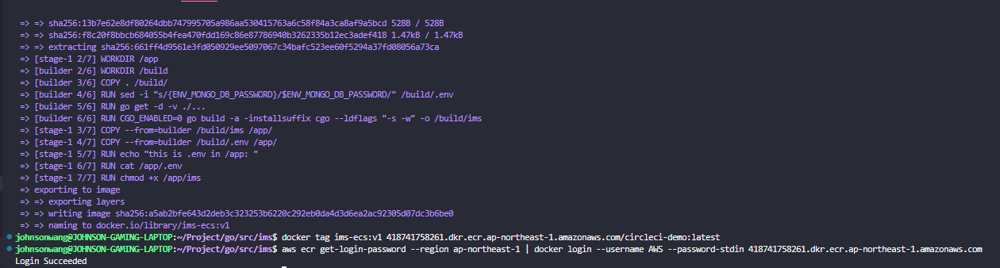

### Then, push the image to the ECR repository

```bash
docker push 418741758261.dkr.ecr.ap-northeast-1.amazonaws.com/circleci:latest
```

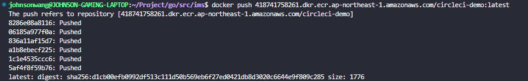

## Task definition

Now that we have an image in the ECR registry, we need a task definition that will be our blueprint to start the Go application. Create task-definition.json file in our project’s root:

### task-definition.json

```json
{
  "family": "circleci-service",
  "containerDefinitions": [
    {
      "name": "circleci-service",
      "image": "418741758261.dkr.ecr.ap-northeast-1.amazonaws.com/circleci:latest",
      "cpu": 128,
      "memoryReservation": 128,
      "portMappings": [
        {
          "containerPort": 8080,
          "protocol": "tcp"
        }
      ],
      "command": ["./main"],
      "essential": true
    }
  ]
}
```

Let’s register the task definition from the command line interface with:

```bash
aws ecs register-task-definition --cli-input-json file://task-definition.json
```

## Create a service

The next step is to create a service that runs the circleci-service task definition (defined in the task-definition.json file). Create ecs-service.json file in our project’s roo:

### ecs-service.json

```json
{
  "cluster": "circleci-cluster",
  "serviceName": "circleci-service",
  "taskDefinition": "circleci-service",
  "loadBalancers": [
    {
      "targetGroupArn": "arn:aws:elasticloadbalancing:ap-northeast-1:418741758261:targetgroup/circleci-target-group/2f7b2ed32bde6c51",
      "containerName": "circleci-service",
      "containerPort": 8080
    }
  ],
  "desiredCount": 1,
  "role": "ecsServiceRole"
}
```

To find the targetGroupArn that was created when creating the circleci-elb load balancer, go to EC2 > Target Groups and click the circleci-target-group. Copy it and substitute the one in targetGroupArn in the ecs-service.json file.


Now, create the circleci-service ECS service:

```bash
aws ecs create-service --cli-input-json file://ecs-service.json
```

If you see below error, please create a role named ecsServiceRole for your account


IAM > Roles


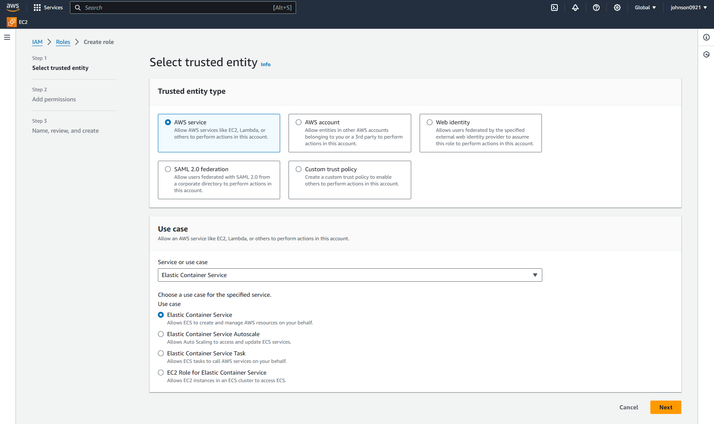


Name it **ecsServiceRole**.

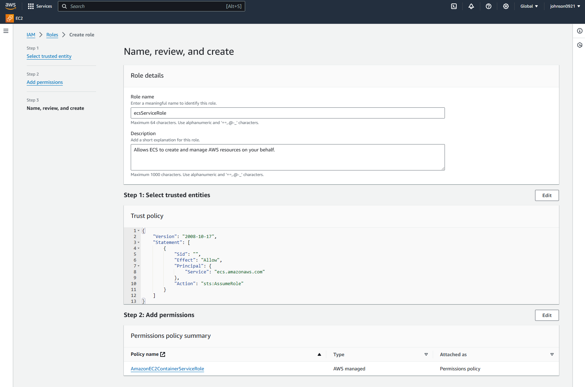

After setting up the role properly, the service can be created successfully


From the ECS console go to Clusters > circleci-cluster > circleci-service and view the Tasks tab. Confirm that the container is running:

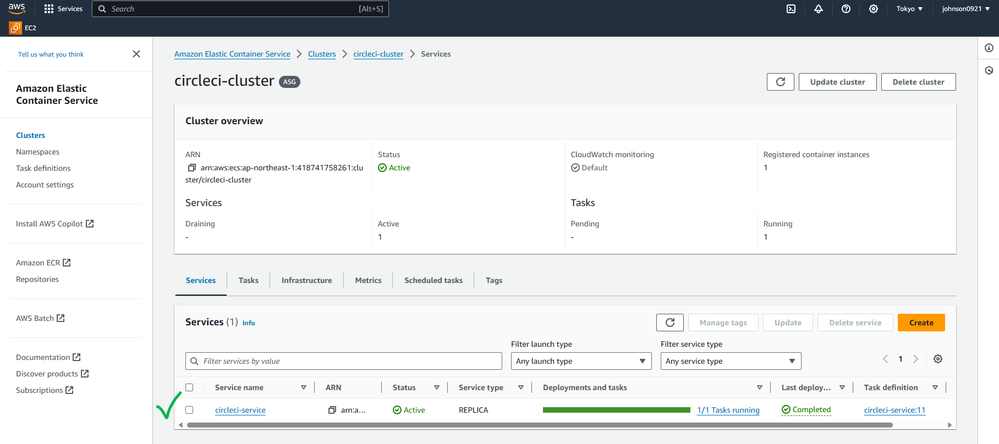

## Configuring CircleCI to deploy

By using CircleCi orbs, we will save massive amounts of time by importing pre-built commands, jobs, and executors into our configuration file. This will also reduce the lines of code in our config greatly by eliminating much of the bash scripting required for AWS deployments.

Enter [CircleCI Application](https://app.circleci.com/)

First, setup the AWS/DB env variable in CircleCI context, go to **_Organization Settings_** **_>_** **_Contexts_**, and click Create Context, name it **aws-dev**.

### Add the following environment variables

| Name                     | Value                |
| ------------------------ | -------------------- |
| AWS_ACCESS_KEY_ID        | \*\*\*\*2BGD         |
| AWS_SECRET_ACCESS_KEY    | \*\*\*\*aTga         |
| AWS_DEFAULT_REGION       | ap-northeast-1       |
| AWS_RESOURCE_NAME_PREFIX | circleci             |
| ENV_MONGO_DB_PASSWORD    | \<your db password\> |

#### Ingore ENV_MONGO_DB_PASSWORD if you are using your own repo


Second, go to **project settings** and add AWS_ACCOUNT_ID into environment variables.

| Name           | Value        |
| -------------- | ------------ |
| AWS_ACCOUNT_ID | 418741758261 |

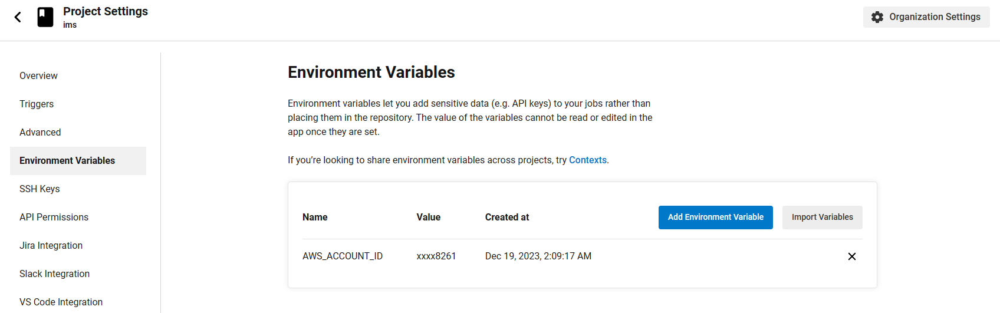


create/update config.yml under .circleci folder

### config.yml

```yml
version: 2.1

orbs:
  aws-cli: circleci/aws-cli@4.1.2
  aws-ecr: circleci/aws-ecr@9.0
  aws-ecs: circleci/aws-ecs@4.0

workflows:
  build-and-deploy:
    jobs:
      - aws-ecr/build_and_push_image:
          account_id: ${AWS_ACCOUNT_ID}
          auth:
            - aws-cli/setup:
                role_arn: arn:aws:iam::${AWS_ACCOUNT_ID}:role/Circleci_orbs_cli_ecr_ecs_role
                role_session_name: circleci-session
          context: aws-dev # config in circleci context page
          create_repo: true
          dockerfile: Dockerfile
          extra_build_args: "--build-arg ENV_MONGO_DB_PASSWORD=${ENV_MONGO_DB_PASSWORD}" # remove if you don't need this DB password
          region: ${AWS_DEFAULT_REGION}
          repo: "${AWS_RESOURCE_NAME_PREFIX}"
          tag: "${CIRCLE_SHA1}"
      - aws-ecs/deploy_service_update:
          context: aws-dev
          auth:
            - aws-cli/setup:
                role_arn: arn:aws:iam::${AWS_ACCOUNT_ID}:role/Circleci_orbs_cli_ecr_ecs_role
                role_session_name: circleci-session
          cluster: ${AWS_RESOURCE_NAME_PREFIX}-cluster
          container_image_name_updates: container=${AWS_RESOURCE_NAME_PREFIX}-service,tag=${CIRCLE_SHA1}
          family: ${AWS_RESOURCE_NAME_PREFIX}-service
          requires:
            - aws-ecr/build_and_push_image
```

#### Note

Please follow below step to setup role_arn and role_session in AWS IAM

Reference: [Authenticate jobs with cloud providers](https://circleci.com/docs/openid-connect-tokens/#authenticate-jobs-with-cloud-providers)

IAM > Identity providers


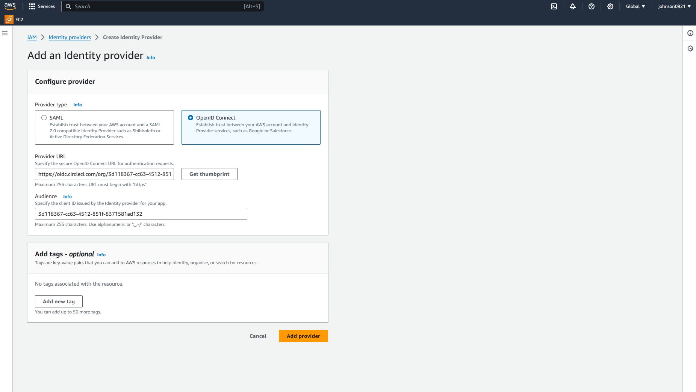

Enter `https://oidc.circleci.com/org/<your-organization-id>` for the Provider URL.

`<your-organization-id>` for the Audience

You can find the organization id in Organization Settings:

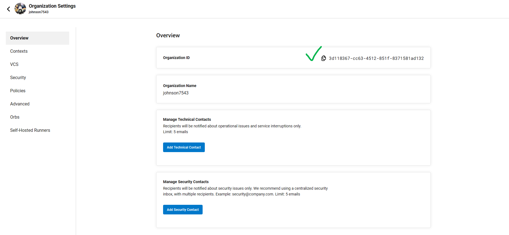

After the provider is created

1. Select **Web identity** and choose `circleci` as the identity provider.
2. Assign required roles to the provider:

   - AmazonEC2ContainerRegistryFullAccess
   - AmazonEC2ContainerServiceRole

3. Name it **Circleci_orbs_cli_ecr_ecs_role**.

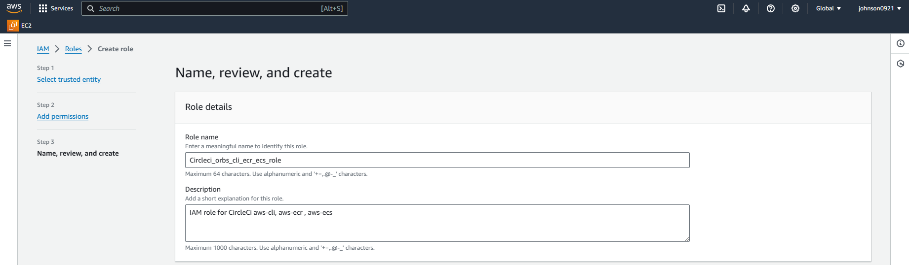

_I added full access to the role which is not AWS best practice, you should know what permission is not required and don’t add it._

---

### Now you have all prepared well 😊

Make some changes to the project and commit to your GitHub.

Check the CircleCi Dashboard and verify the deployment status.

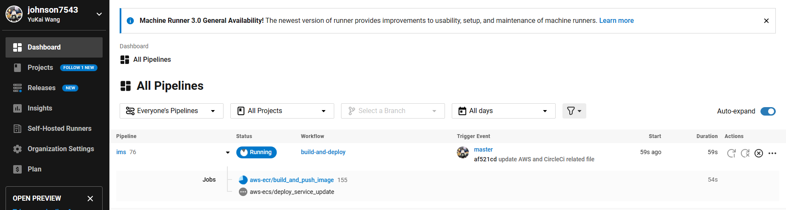

Health check:

```bash
curl --location 'circleci-elb-tokyo-422160389.ap-northeast-1.elb.amazonaws.com/health'
```


